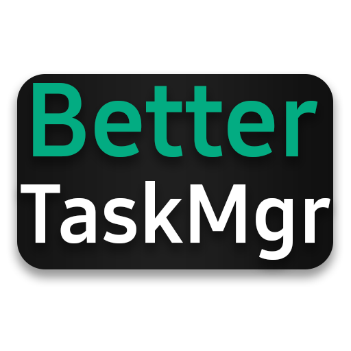

# BetterTaskMgr 
</img>

An improved version of the windows 10 task manager.

<!--  -->

# Features
* 🌙 Dark Mode
* ✨ A more futuristic looking interface
* 🥚 Easter eggs? Well I mean... maybe
* 💻 M O D E R N

BetterTaskMgr was made in Electron. Electron is also used in other applications like 
Discord, WhatsApp Destop, Slack and even Visual Studio Code, which is used to make this.

BetterTaskMgr may have some downsides compared to the windows 10 task manager, 
but we will always try our best to improve it for matching results.

# Installation Guide
* Before installing the application, you need to install [Electron](https://electronjs.org/) and [NPM](https://nodejs.org/en/download/).
* Once you're in the directory you want to install the app in, open a new terminal window and navigate to the current path.
* After installing Electron and NPM, run the `electron` command to make the Electron works. Make sure to do the same thing with NPM as well by running `npm`.
* If both commands work, install the application in the current path using `git clone https://www.github.com/SuspectAverage5/BetterTaskMgr.git`.
* To install all the required modules for the application, run `npm install` or `npm i` (This process may take up to 10 minutes depending on internet speed).
* Once the required modules are installed, you can now run the application using `npm start`.

### Caching
* By default, the cache folder is set to the current directory of your app. If you want to modify its location, go to the beginning of `./src/index.js` and change the `userCache` or `userData` keys to your preferred path. Try using complete (absolute) paths *example: `C:/Users/User/Documents/userCache`*.

**Kenan238/SuspectAverage5**
